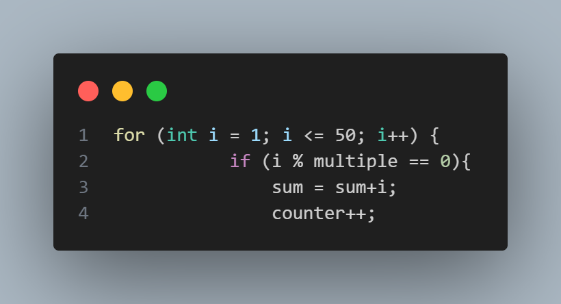

### lab 1
1. in looping for have 3 component that is 
-  initiation is declaration and instalitation counter variable
-  condition is limits or requarement for the loop to continue running and 
-  update is changes in the counter value every loop 
2.   
 in this code use a for looping and inside there is selection if .This code uses a for loop, which means that if the condition is true, the code will run repeatedly until it is false (more than 50) and the variable will add 1 for every loop and variable i looping with sum and counter, where is counter for how many number that are multiple and sum for total of all multiple in range 1-50.
3. I will add

### lab 2

### lab 3

### lab 4 